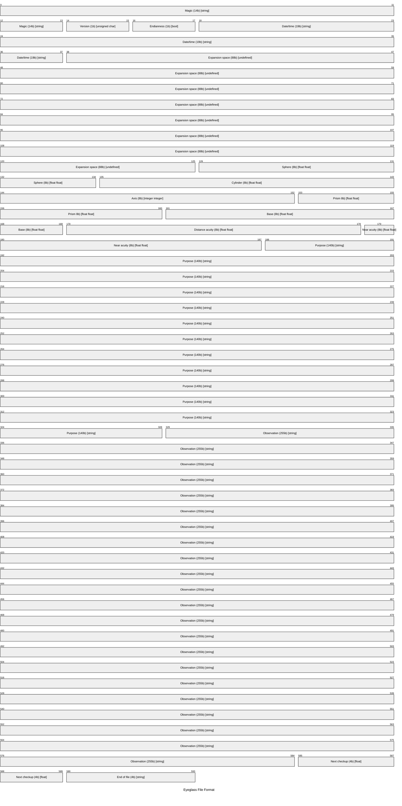

# eyeglass

Sample 'file format' specification and applications for understanding issues in
digital preservation. The format stores the information required for an eyeglass
prescription for a single patient.

## Specification

    Eyeglass Format Specification 1.0
    ---
    Magic number    - 14 bytes  - String
    Version         - 1 bytes   - Unsigned Char
    Big-endian      - 1 byte    - Bool
    Date/time       - 19 bytes  - String #YYYY-MM-DDTHH:MM:SS
    Expansion room  - 88 bytes  - Undefined
    Sphere          - 8 bytes   - R: Float   L: Float
    Cylinder        - 8 bytes   - R: Float   L: Float
    Axis            - 8 bytes   - R: Integer L: Integer
    Prism           - 8 bytes   - R: Float   L: Float
    Base            - 8 bytes   - R: Float   L: Float
    Distance acuity - 8 bytes   - R: Float   L: Float
    Near acuity     - 8 bytes   - R: Integer L: Integer
    Purpose         - 140 bytes - String
    Observation     - 255 bytes - String
    Next checkup    - 4 bytes   - Float
    End of file     - 4 bytes   - String

The *‘magic number’* identifying the file format will be as follows:

    '\xBB\x0D\x0A\x65\x79\x65\x67\x6C\x61\x73\x73\x1A\x0A\xAB'

The *‘end of file’* sequence terminating the stream will be as follows:

    '\xBB\x65\x6f\x66'

## Mermaid

Mermaid has a new packet representation. It might be a good way to
represent file format layouts. Some consideration needs to be given
to how to better display long lines of text, below.



```text
---
title: "Eyeglass File Format"
config:
  packet:
    paddingX: 16
    paddingY: 16
    showbits: true
    rowHeight: 40
    bitWidth: 140
    bitsPerRow: 12

---
packet-beta 
0-13: "Magic (14b) [string]"
14-15: "Version (1b) [unsigned char]"
16-17: "Endianness (1b) [bool]"
18-37: "Date/time (19b) [string]"
38-125: "Expansion space (88b) [undefined]"
126-134: "Sphere (8b) [float float]"
135-143: "Cylinder (8b) [float float]"
144-152: "Axis (8b) [integer integer]"
153-160: "Prism 8b) [float float]"
161-169: "Base (8b) [float float]"
170-178: "Distance acuity (8b) [float float]"
179-187: "Near acuity (8b) [float float]"
188-328: "Purpose (140b) [string]"
329-584: "Observation (255b) [string]"
585-589: "Next checkup (4b) [float]"
590-593: "End of file (4b) [string]"
```

## Further reading

* [exponentialdecay.co.uk/blog/genesis-of-a-file-format][expo-1].
* [exponentialdecay.co.uk/blog/shattering-the-eyeglass][expo-2].

[expo-1]: http://exponentialdecay.co.uk/blog/genesis-of-a-file-format/
[expo-2]: https://exponentialdecay.co.uk/blog/shattering-the-eyeglass/
